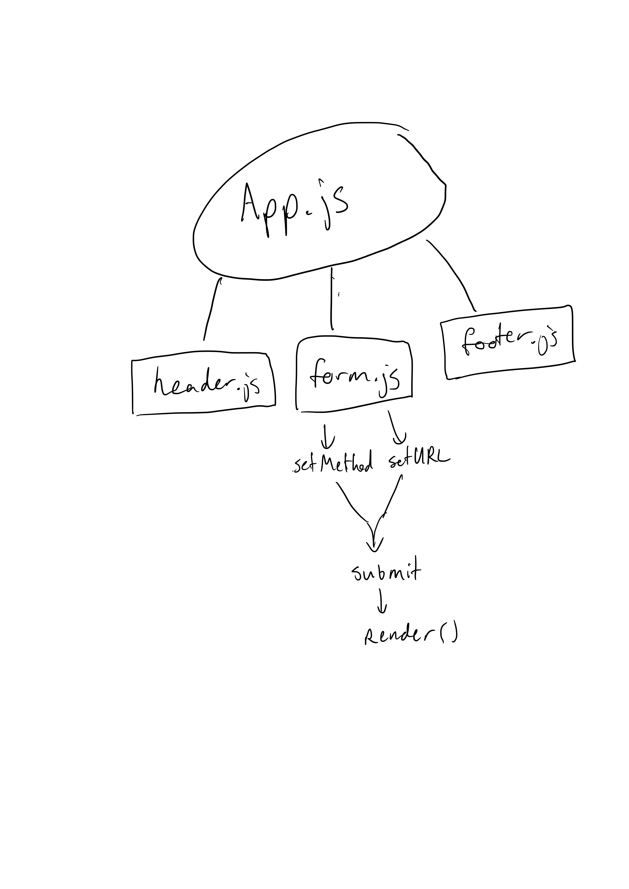

# LAB - Class 26

## Project: RESTy

### Author: Joshua Williams

### Links and Resources

- [Custom Radio Form](https://www.w3schools.com/howto/howto_css_custom_checkbox.asp)

### Setup

```
git clone https://github.com/josh-williams-401-advanced-javascript/resty.git

cd resty
```

#### `.env` requirements

N/A  

#### How to initialize/run your application  

```
npm start
```

#### How to use your library 
N/A

#### Tests
N/A

#### UML

