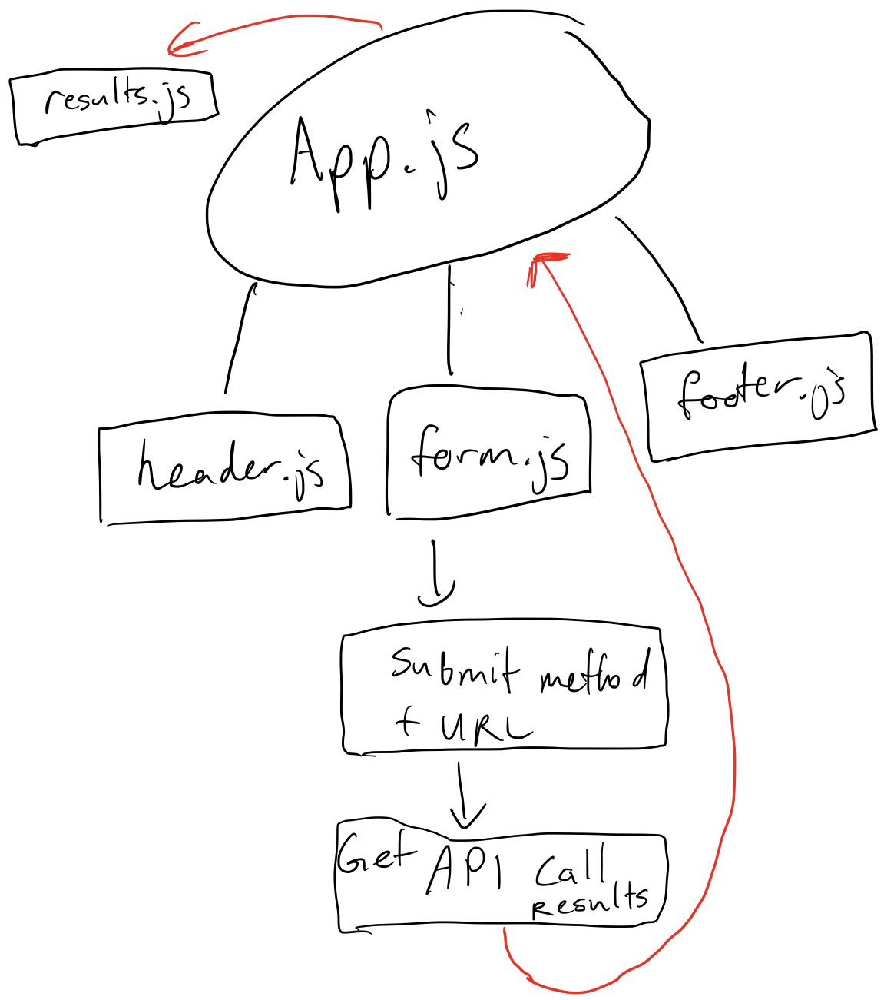

## Project: RESTy

### Author: Joshua Williams

### Links and Resources

- [Custom Radio Form](https://www.w3schools.com/howto/howto_css_custom_checkbox.asp)
- [Test Help](https://stackoverflow.com/questions/56267336/react-testing-library-check-the-existence-of-empty-div)
- Loading spinner provided by `loading.io`

# Class 27

### Setup

```
git clone https://github.com/josh-williams-401-advanced-javascript/resty.git

cd resty
```

#### `.env` requirements

N/A  

#### How to initialize/run your application  

```
npm start
```

#### How to use your library 
On the website, enter a api request url, select a method, and press submit. The results will be displayed beneath. At the moment, every request will be a `GET` request. A sample url you can test is this:
```
https://swapi.dev/api/planets/
```
Feel free to test others.

#### Tests
```
npm test
```

#### UML



# Class 26

### Setup

```
git clone https://github.com/josh-williams-401-advanced-javascript/resty.git

cd resty
```

#### `.env` requirements

N/A  

#### How to initialize/run your application  

```
npm start
```

#### How to use your library 
N/A

#### Tests
N/A

#### UML

