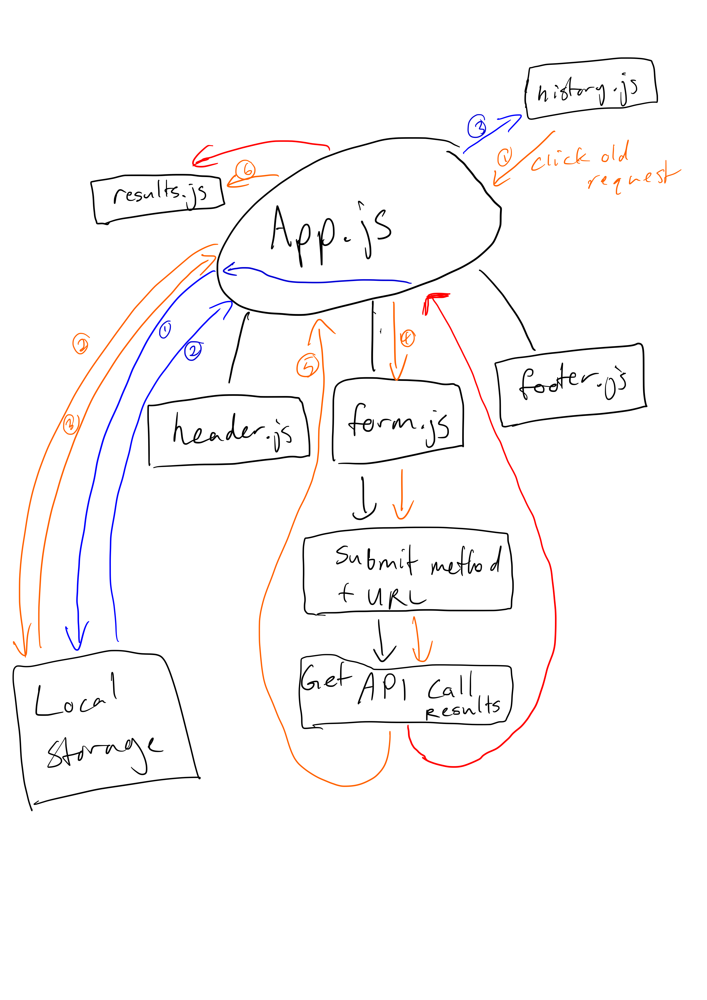

# Project: RESTy

### Deployed Site: https://youthful-dijkstra-b8b6d0.netlify.app/

### Author: Joshua Williams

### Links and Resources

- [Custom Radio Form](https://www.w3schools.com/howto/howto_css_custom_checkbox.asp)
- [Test Help](https://stackoverflow.com/questions/56267336/react-testing-library-check-the-existence-of-empty-div)
- Loading spinner provided by `loading.io`

# Class 28

### Setup

```
git clone https://github.com/josh-williams-401-advanced-javascript/resty.git

cd resty
```

#### `.env` requirements

N/A  

#### How to initialize/run your application  

```
npm start
```

#### How to use your library 
On the website, enter a api request url, select a method, and press submit. The results will be displayed beneath. Make different types of requests by select `GET`, `POST`, `PUT`, or `DELETE`, and fill out the body as needed. There is a spinner to watch while the results load. Past searches will be saved in Local Storage. If you click on old requests, it will make get the results again, and fill out the form (mostly) to match the request. If you change an input field, this feature will not work as well. 
```
https://swapi.dev/api/planets/
```
Feel free to test others.

#### Tests
```
npm test
```

#### UML



# Class 27

### Setup

```
git clone https://github.com/josh-williams-401-advanced-javascript/resty.git

cd resty
```

#### `.env` requirements

N/A  

#### How to initialize/run your application  

```
npm start
```

#### How to use your library 
On the website, enter a api request url, select a method, and press submit. The results will be displayed beneath. At the moment, every request will be a `GET` request. A sample url you can test is this:
```
https://swapi.dev/api/planets/
```
Feel free to test others.

#### Tests
```
npm test
```

#### UML


# Class 26

### Setup

```
git clone https://github.com/josh-williams-401-advanced-javascript/resty.git

cd resty
```

#### `.env` requirements

N/A  

#### How to initialize/run your application  

```
npm start
```

#### How to use your library 
N/A

#### Tests
N/A

#### UML

